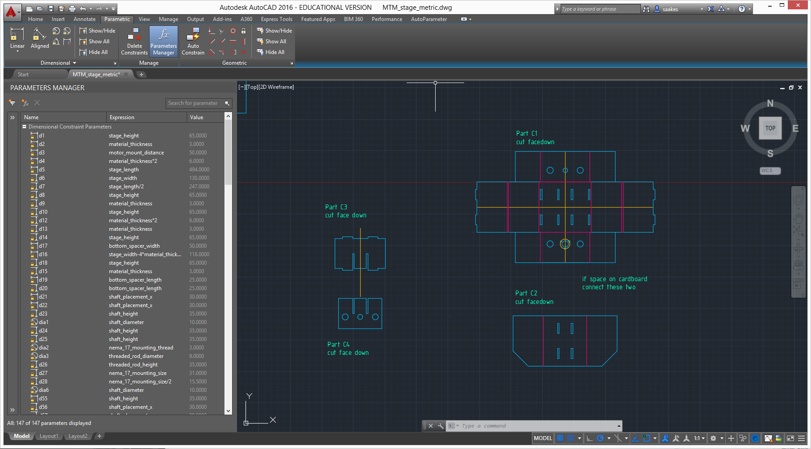
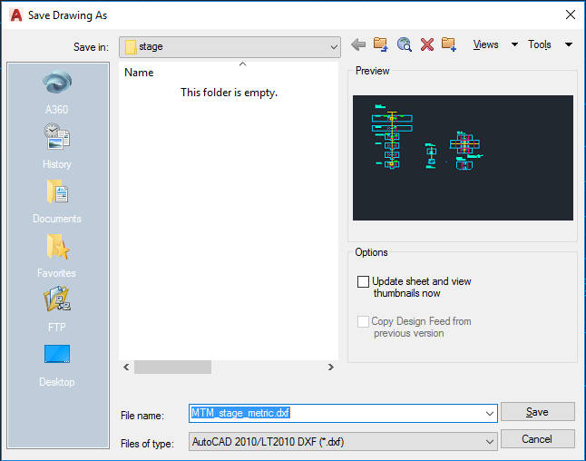
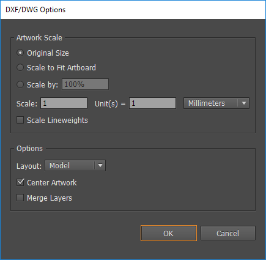

# cardboard-stage-metric

This repository contains a port of the [MtM configurable cardboard stage](http://mtm.cba.mit.edu/machines/science/) made by MIT Center for Bits and Atoms by [James Coleman and Nadya Peek](http://archive.monograph.io/james/m-mtm). We use this version in the Digital Design Fabrication Course at Industrial Design KAIST.

The main file is an Autocad drawing. Why Autocad? because can make parametric 2D drawings with multiple colors, which was essential for cutting cardboard with multiple laser settings. The Autocad file with the parameters drives a 3D Inventor model.

For laser cutting, export the drawing as a DXF (AutoCAD 2010) format, as shown below.

In Illustrator, open the DXF file and set the options as below, to make sure that your drawing is on scale (in mm).

